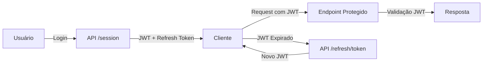

# 📦 Inventory Manager API


Projeto pessoal de estudo, construído com **TypeScript**, **Node.js**, **Express**, **PostgreSQL** e **TypeORM**.

Simula uma API de gerenciamento de estoque e serve como prática de **SOLID**, **Clean Architecture** e **DDD (Domain-Driven Design)**, aplicados a um módulo de usuários com autenticação, autorização e persistência de dados.

---

## 🎯 Sobre o projeto

Este repositório documenta como estruturei uma API em camadas seguindo Clean Architecture e DDD: separação entre domínio, aplicação e infraestrutura, casos de uso isolados das regras de negócio e controle de acesso baseado em papéis (RBAC).

---

## 📚 Documentação da API (Swagger)

Documentação interativa disponível via **Swagger UI**.
Após subir o projeto localmente, acesse: `http://localhost:PORT/api-docs`

---

## 🚀 Tecnologias Utilizadas

- **Node.js** – Ambiente de execução JavaScript no servidor
- **TypeScript** – Superset do JavaScript com tipagem estática
- **Express** – Framework web minimalista e rápido
- **PostgreSQL** – Banco de dados relacional (v15 ou superior)
- **TypeORM** – ORM para integração com o banco
- **JWT** – Autenticação segura via tokens
- **Refresh Token** – Persistência de sessão de forma segura
- **CASL** – Controle de acesso baseado em papéis (RBAC)
- **Vitest** – Testes unitários e de integração
- **Docker & Docker Compose** – Containerização e orquestração

---

## ✅ Funcionalidades

- Cadastro de usuário
- Autenticação com JWT e persistência de sessão via refresh token
- Controle de acesso baseado em papéis (RBAC) com CASL, incluindo o modelo de permissões para produtos, categorias, estoque e transações em [src/infrastructure/rbac](src/infrastructure/rbac)
- Consulta de perfil do usuário autenticado
- Cobertura de testes unitários para as camadas de domínio e aplicação

---

## 📂 Estrutura do Projeto (EAP)

```
src/
├── test/               # Testes unitários, integração e e2e
├── core/               # Casos de uso, contratos e lógica de aplicação
├── domain/             # Entidades e regras de negócio
├── infrastructure/     # Banco de dados, TypeORM, rotas, middlewares e serviços externos
├── main/               # Configurações de inicialização
├── shared/             # Utilitários e módulos comuns
```

---

## 🛠 Instalação e Configuração

A API roda localmente (via npm); o Docker Compose deste projeto sobe apenas o banco de dados PostgreSQL.

### 1️⃣ Pré-requisitos
- **Node.js** >= 18
- **Docker** >= 24
- **Docker Compose** >= 2.0

### 2️⃣ Configurar variáveis de ambiente
Crie um arquivo `.env` na raiz do projeto:

```env
# DB CONFIG
DB_HOST=
DB_PORT=
DB_USER=
DB_PASSWORD=
DB_NAME=

# DATABASE URL
DATABASE_URL=

# ENVIRONMENT
NODE_ENV=

# PORTS
PORT=

# AUTH
JWT_SECRET=
REFRESH_TOKEN_SECRET=
EXPIRES_REFRESH_TOKEN_DAYS=
```

> **Observação:** Os valores de `DB_HOST` e `DB_PORT` devem corresponder ao serviço `inventory-pg` definido no `docker-compose.yml`.

### 3️⃣ Instalar dependências

```bash
npm install
```

---

## ▶️ Subindo o banco de dados

```bash
docker-compose up -d
```

Isso irá:
- Criar e iniciar um container para o PostgreSQL
- Criar um volume para persistência dos dados do banco

---

## 🔄 Executando migrations

```bash
npm run migration:run
```

---

## ▶️ Rodando a aplicação

```bash
npm run dev
```

---

## 📥 Parando o banco de dados

```bash
docker-compose down
```

Se quiser remover volumes e dados do banco:
```bash
docker-compose down -v
```

---

## 🔑 Fluxo de Autenticação


---

## 📌 Rotas Disponíveis

| Método | Endpoint          | Descrição               | Autenticação |
|--------|-------------------|--------------------------|--------------|
| POST   | `/users`          | Criar usuário            | ❌           |
| POST   | `/session`        | Autenticar usuário       | ❌           |
| POST   | `/refresh/token`  | Atualizar token de acesso| ✅ (cookie)  |
| GET    | `/me`             | Obter perfil do usuário  | ✅           |

---

## 🧪 Testes

Este projeto utiliza **Vitest** para testes unitários.

⚠️ **Atenção:**
Para rodar os testes unitários é necessário criar um arquivo de variáveis de ambiente chamado `.env.test` na raiz do projeto, contendo as configurações de ambiente específicas para o ambiente de teste (como banco de dados, JWT_SECRET, REFRESH_TOKEN_SECRET, etc).

Para rodar os testes:
```bash
npm run test
```

Para rodar os testes em modo watch:
```bash
npm run test:watch
```

Para gerar o coverage:
```bash
npm run coverage
```

---

## 🧹 Lint

O projeto utiliza **ESLint**. Para verificar o código:
```bash
npm run lint
```

Lint e testes rodam automaticamente a cada push/PR via GitHub Actions ([.github/workflows/ci.yml](.github/workflows/ci.yml)).

